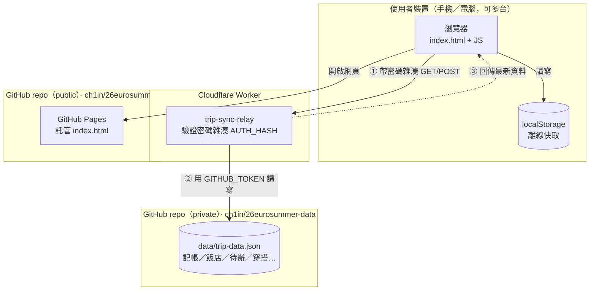

# 26eurosummer — 德瑞義 16 日鐵道行

單頁旅遊規劃 App(行事曆／待辦／每日行程／記帳／穿搭),由 GitHub Pages 託管,並透過一個 Cloudflare Worker 中繼站做跨裝置資料同步。

**網址**:https://ch1in.github.io/26eurosummer/(需要帳號密碼才能檢視內容)

## 架構

- **前端(`index.html`)**:純靜態頁面,登入時用 `SHA-256(帳號:密碼)` 跟頁面裡寫死的雜湊比對;資料先存進瀏覽器 `localStorage`,每次變更後 1.2 秒自動打一次同步請求。
- **Cloudflare Worker(`worker.js`)**:唯一保存 GitHub 寫入權杖(`GITHUB_TOKEN`)的地方,前端只會把「密碼雜湊」當 Bearer Token 送過來，Worker 驗證通過才會代為讀寫資料檔。**`GITHUB_TOKEN` 不會出現在任何前端程式碼裡**。
- **`ch1in/26eurosummer`(public)**:只放靜態網頁本體(`index.html`),用 GitHub Pages 對外提供服務。不放任何旅遊資料。
- **`ch1in/26eurosummer-data`(private)**:只放 `data/trip-data.json` 這個實際資料檔,repo 本身是 private,只有 Worker 手上的 `GITHUB_TOKEN` 能讀寫,不會被任何人直接瀏覽到。

## 已知限制

- 密碼鎖是純前端檢查,原始碼本身(含密碼雜湊 `AUTH_HASH`)在 public repo 裡任何人都看得到——這代表知道這串雜湊的人理論上可以直接呼叫 Worker 的 API 讀寫資料,不需要真的知道密碼。密碼鎖擋得住一般訪客,擋不住刻意讀原始碼的人。
- `data/trip-data.json` 透過 GitHub Contents API 讀寫,單檔上限約 1MB,穿搭照片上傳時會自動壓縮以避免超過。
